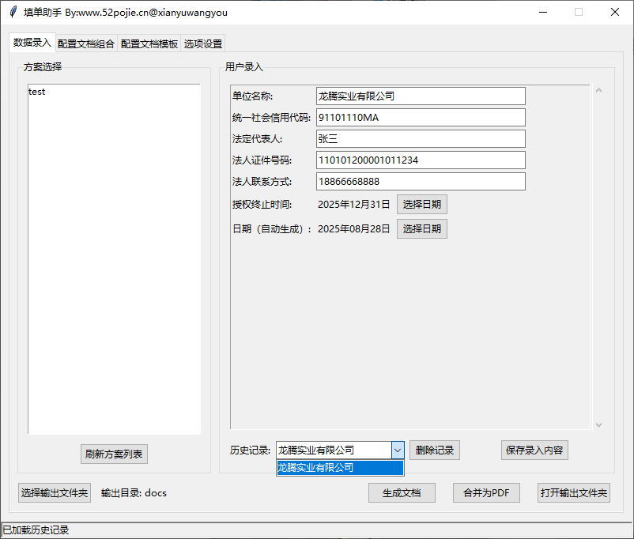
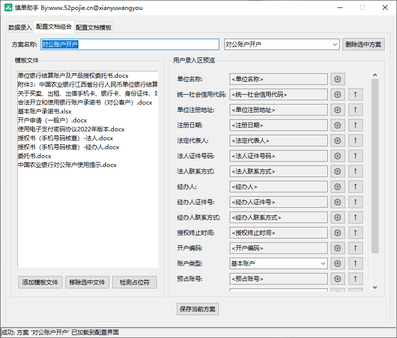
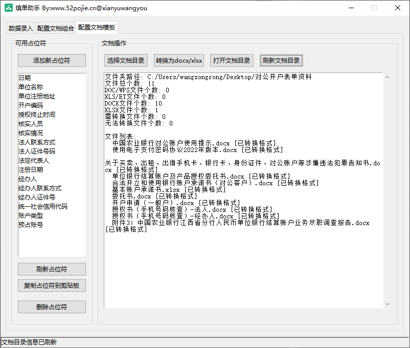
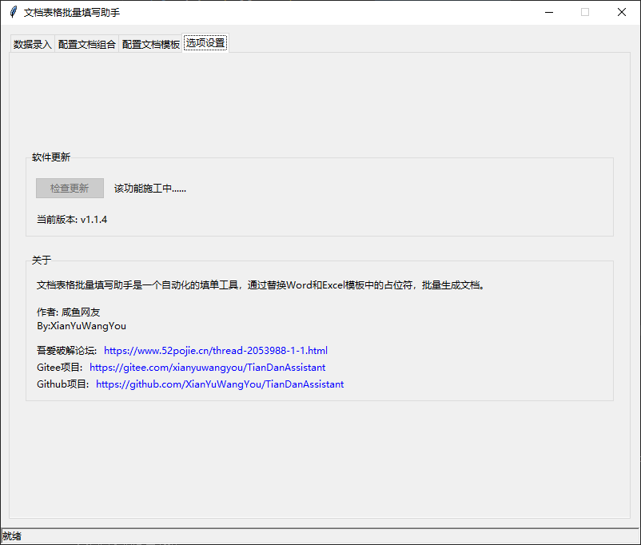

# 填单助手 (TianDanAssistant)


填单助手是一个自动化文档处理工具，可以自动识别Word和Excel模板中的占位符，并根据用户输入的信息批量生成填写完成的文档。

## 功能特点

- **自动识别占位符**：自动扫描Word(.docx)和Excel(.xlsx)模板中的占位符（格式为`{占位符名称}`）
- **批量处理**：一次性处理多个模板文件，提高工作效率
- **多格式支持**：支持Word文档和Excel表格的占位符替换
- **界面友好**：提供图形用户界面，操作简单直观
- **配置保存**：支持保存常用的输入信息和处理方案，方便下次使用
- **方案管理**：支持创建和管理多个处理方案，每个方案可包含不同的模板文件和占位符顺序
- **占位符编辑**：支持在模板中添加、修改和删除占位符
- **PDF转换**：支持将生成的Word文档转换为PDF格式

## 应用场景

该工具特别适用于需要重复填写大量相似文档的场景，例如：

- 银行贷款申请材料填写
- 各类业务申请表处理
- 标准化文档批量生成
- 表格数据自动填充

## 安装依赖

在使用前，请确保已安装所有必要的依赖库：

```
pip install -r requirements.txt
```

主要依赖包括：
- python-docx==0.8.11
- docx2pdf==0.1.8
- PyPDF2==3.0.1
- openpyxl==3.1.2

## 使用方法

1. 运行程序：
   ```bash
   python document_processor.py
   ```

2. 程序包含三个主要功能标签页：
   - **数据录入**：选择模板文件，填写信息并生成文档
   - **方案配置**：创建和管理处理方案，保存模板文件列表和占位符顺序
   - **模板制作**：管理和编辑模板中的占位符

3. 在"数据录入"标签页中：
   - 选择已保存的方案
   - 程序生成录入区
   - 填写相应的信息到对应录入框中
   - 选择输出目录并生成填写完成的文档

4. 在"方案配置"标签页中：
   - 创建新的文档组合方案或加载已有的方案
   - 添加文档模板并检测其中的占位符
   - 调整占位符顺序、种类
   - 保存方案以便在数据录入页中调用

5. 在"模板制作"标签页中：
   - 选择模板文件夹
   - 添加新占位符或修改现有占位符
   - 打开文档后，将占位符复制到指定位置
   - 保存模板文档

## Wiki文档同步

项目包含完整的Wiki文档，可以通过以下脚本同步到Gitee Wiki：

### Windows系统
```cmd
sync_wiki.bat
```

### Linux/Mac系统
```bash
chmod +x sync_wiki.sh
./sync_wiki.sh
```

### Python脚本方式
```bash
python sync_wiki.py
```

## 软件界面预览

以下是填单助手的界面预览图：

<div style="display: flex; flex-wrap: wrap; gap: 10px;">
  
  
  
  
</div>

## 配置文件说明

- `config.json`：保存用户输入信息和程序设置
- `schemes.json`：定义不同的处理方案，包括模板文件列表和占位符顺序

## 支持与赞助

如果您觉得本项目对您有帮助，欢迎通过以下方式支持开发者：

<div style="text-align: center;">
  
</div>

## 开发者信息

开发者：咸鱼网友 (XianYuWangYou)

## 许可证

本项目采用GNU General Public License v3.0许可证，详情请参见[LICENSE](LICENSE)文件。